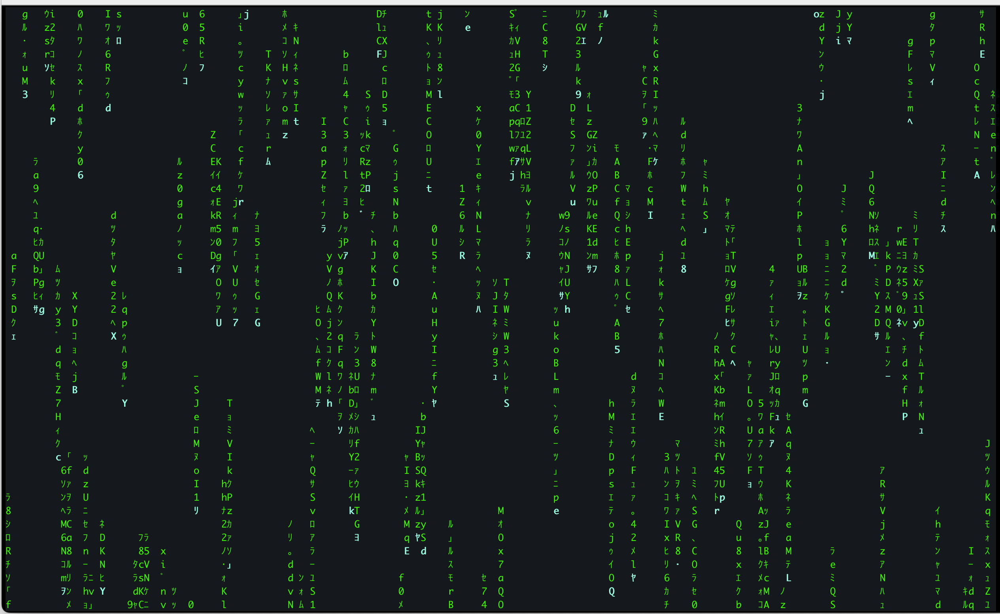

# Matrix Rain Terminal Effect

A Python script that simulates the digital rain from the movie "The Matrix" in the terminal using curses.

## Features
-Cyan green head color
-Smooth column fade-out
-Binary intro ('0s and 1s') before the rain
-Press 'q' to stop the rain. 

## Install
```bash
pip install -r requirements.txt
python matrix_rain.py


